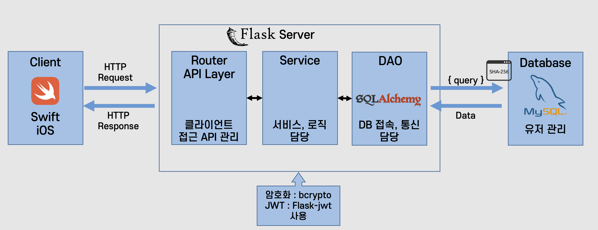
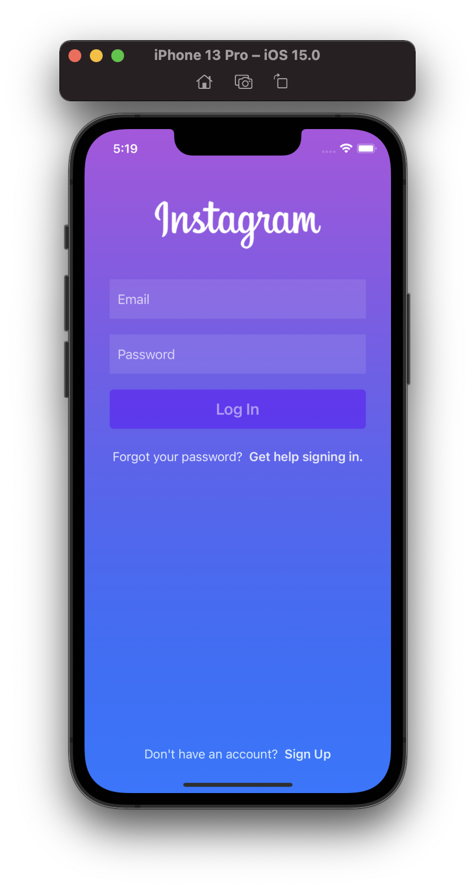
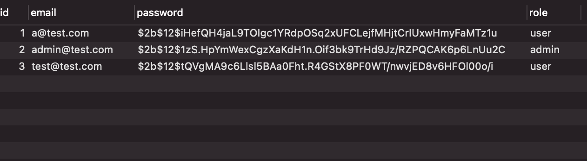

# SGS_AuthenticationSystem

## 시스템 요구사항

- [x]  사용자 DB 설계
- [x]  가입, 로그인 페이지
- [x]  인증 서버(API)
- [x]  RDBMS(MySQL)
- [x]  패스워드 암호화
- [ ]  Admin의 유저 관리 페이지

## 옵션

- [ ]  E-mail 인증
- [ ]  비밀번호 찾기
- [ ]  캐시

## 시스템 아키텍처 설계

## 구현화면
### 메인화면

### 회원가입

### 회원가입 후 DB (비밀번호 암호화)

### 로그인 (유저)

### 로그인 (어드민)
- 개발중...

## 노션
https://broad-muenster-a6c.notion.site/Authentication-System-fd7bca62727a486794bbd9db1e8fbf89